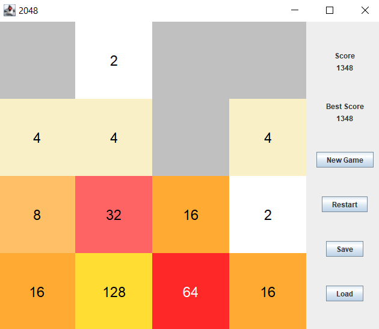
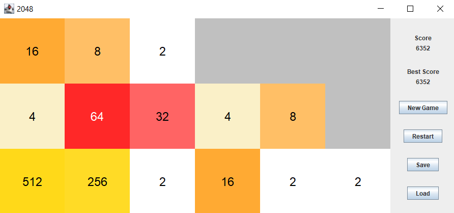

# Variations on 2048
Re-implementation of the web game 2048, except in Java and GUI made with Swing.

### Features
- All the same game rules as the original
- System for saving the game, which also preserves the best score for persistence between games
- Grid dimensions are easily customizable

### Future features
- Add game rule variations, such as following sequences (e.g. Fibonacci)
- Adapt save system to allow multiple save files and selection when loading/saving
- Encrypt save files to prevent manipulation of game state

### Screenshots

